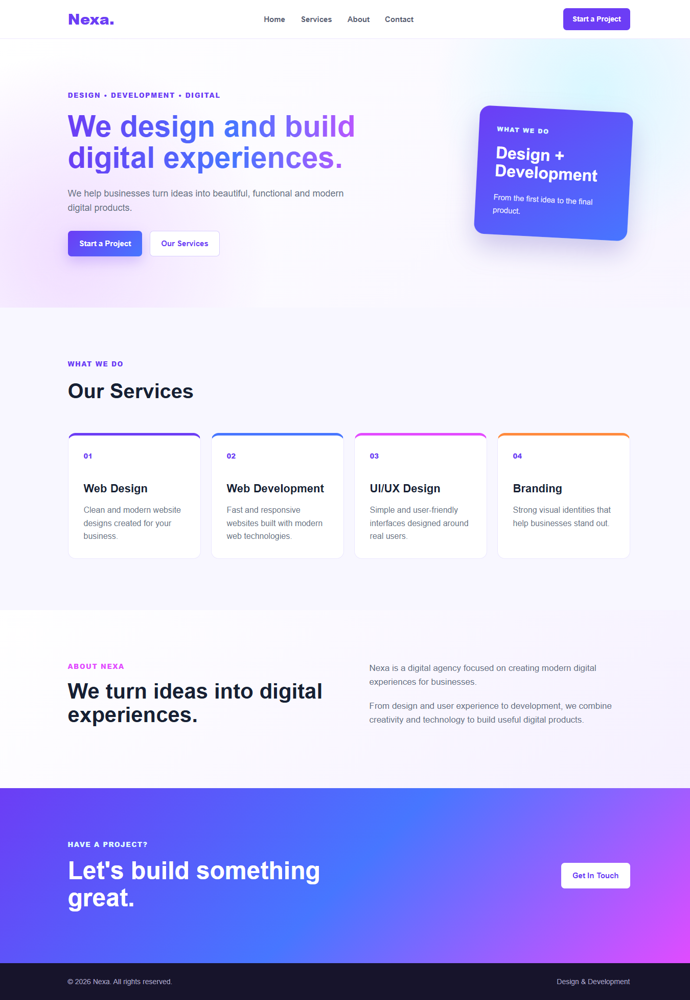

🚀 Nexa — Design & Development

A modern and responsive digital agency website for Nexa, showcasing web design, web development, UI/UX design, and branding services.

🖼️ Screenshot

🛠️ Technologies Used
HTML5
CSS3
✨ Main Features
Responsive agency website
Navigation menu with smooth scrolling
Hero section with call-to-action buttons
Services section
About section
Contact section
Hover effects and smooth animations
Mobile-friendly layout
Clean and modern design
📦 Dependencies

This project does not require any npm packages, frameworks, or external libraries.

No JavaScript dependencies
No npm packages
No CSS frameworks
💻 Run Locally

Clone the repository:

git clone https://github.com/nobin-codes/business-demo-website.git

Open the project folder:

cd business-demo-website

Open index.html in your browser.

No installation or build process is required.

🔗 Relevant Links
🌐 Live Demo: https://nobin-codes.github.io/business-demo-website/
💻 GitHub Repository: https://github.com/nobin-codes/business-demo-website
📁 Project Structure
business-demo-website/
├── assets/
├── index.html
├── style.css
└── README.md
